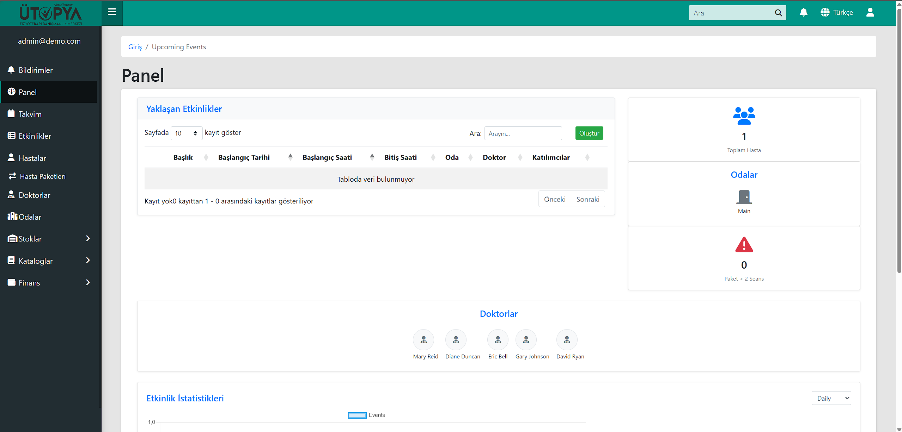

# Utopia-Playwright-Tests
Utopia projesi için Playwright ile geliştirilmiş otomasyon testleri. Kullanıcı giriş/çıkışı, CRUD işlemleri, form elemanları, dosya yükleme ve liste kontrollerini kapsar.
---

## 📌 Proje Hakkında

Utopia, Django tabanlı bir yönetim paneli ve çeşitli modüllerden oluşan bir web uygulamasıdır.  
Proje; hasta, doktor, stok, ödeme, etkinlik, paket gibi birçok yönetim ekranı içermektedir.

---

## 🧪 Test Süreci

Testler **Playwright** framework'ü kullanılarak yazılmıştır.  
Otomasyon testleri ile doğrulanan başlıca işlemler:

- Kullanıcı girişi ve çıkışı
- Hasta, doktor, stok, paket, ödeme, etkinlik, tedavi, muayene, oda vb. modüllerde **kayıt oluşturma**, **güncelleme** ve **listeleme**
- Select2 gibi özel form elemanlarının otomasyonu
- Görsel yükleme ve dosya inputlarının test edilmesi
- Tablo ve liste kontrolleri

---

## ⚙️ Kurulum ve Ortam Değişkenleri

1. **Node.js** kurulu olmalıdır.  
   [Node.js resmi sitesi](https://nodejs.org/) üzerinden yükleyebilirsiniz.

2. Bağımlılıkları yükleyin:
   ```sh
   npm install -D @playwright/test
   npx playwright install
   ```

3. `.env` dosyası oluşturun ve gerekli ortam değişkenlerini ekleyin:
   ```env
   BASE_URL=http://localhost:8000
   TEST_USERNAME=admin
   TEST_PASSWORD=admin123
   ```
   - BASE_URL değeri testlerin çalışacağı ortamın adresi olmalıdır.
   - TEST_USERNAME ve TEST_PASSWORD giriş yapılacak kullanıcı bilgilerini temsil eder.

4. Testleri çalıştırın:
   ```sh
   npx playwright test app/tests/playwright/
   ```
   Belirli bir test dosyasını çalıştırmak için:
   ```sh
   npx playwright test app/tests/playwright/login.spec.js
   ```

---

## 📷 Proje Görüntüleri

Aşağıdaki resimler, projenin arayüzüne dair örneklerdir:



---

## 📂 Test Dosyaları

Tüm test dosyaları `app/tests/playwright/` klasöründe yer almaktadır.  
Her modül için ayrı test dosyaları oluşturulmuştur.

---

⚠️ Not: Test kodlarının tamamı bana aittir ve bu repoda paylaşılmıştır.

---

# About Playwright Tests and Project (English Version)

This repository contains Playwright automation tests for the Utopia project.  
All test codes are developed by me and shared to prove ownership of the test processes.

---

## 📌 About the Project

Utopia is a Django-based admin panel and web application with various modules.  
The project includes management screens for patient, doctor, stock, payment, event, package, and more.

---

## 🧪 Test Process

Tests are written using the Playwright framework.  
The automation tests verify the following:

- User login and logout
- Creating, updating, and listing records for modules such as patient, doctor, stock, package, payment, event, treatment, examination, room, etc.
- Automation of special form elements like Select2
- Image upload and file input testing
- Table and list controls

---

## ⚙️ Setup & Environment Variables

1. Node.js must be installed.  
   Download from [Node.js official site](https://nodejs.org/).

2. Install dependencies:
   ```sh
   npm install -D @playwright/test
   npx playwright install
   ```

3. Create a `.env` file and set the required environment variables:
   ```env
   BASE_URL=http://localhost:8000
   TEST_USERNAME=admin
   TEST_PASSWORD=admin123
   ```
   - BASE_URL is the environment URL where tests will run.
   - TEST_USERNAME and TEST_PASSWORD are the login credentials for the tests.

4. Run all tests:
   ```sh
   npx playwright test app/tests/playwright/
   ```
   Run a specific test file:
   ```sh
   npx playwright test app/tests/playwright/login.spec.js
   ```

---

## 📷 Project Screenshots

The images below are examples of the project's interface:


---

## 📂 Test Files

All test files are located in the `app/tests/playwright/` folder.  
Each module has its own test file.

---

All test codes are written by me and shared in this repository.
